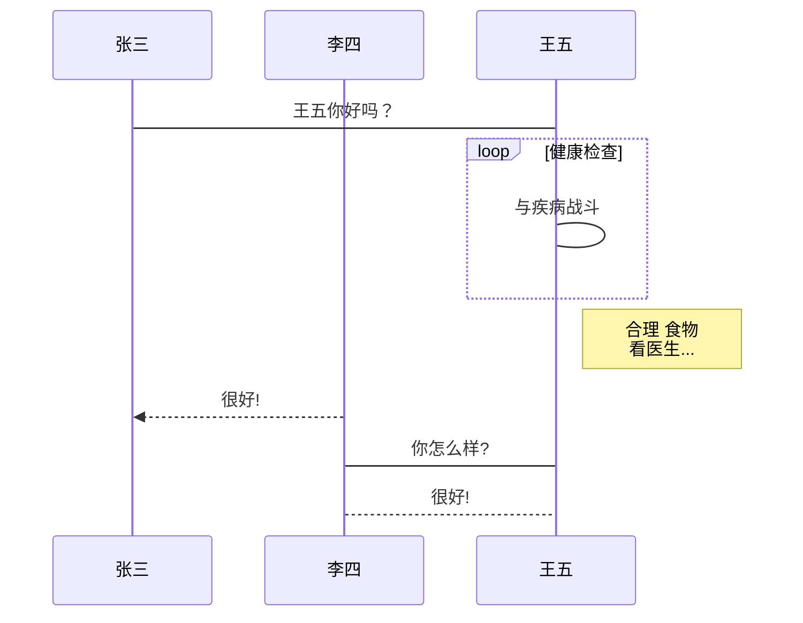
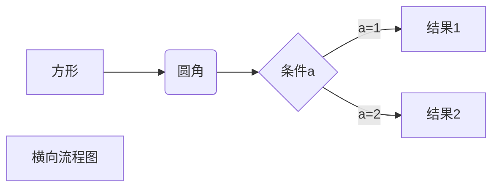
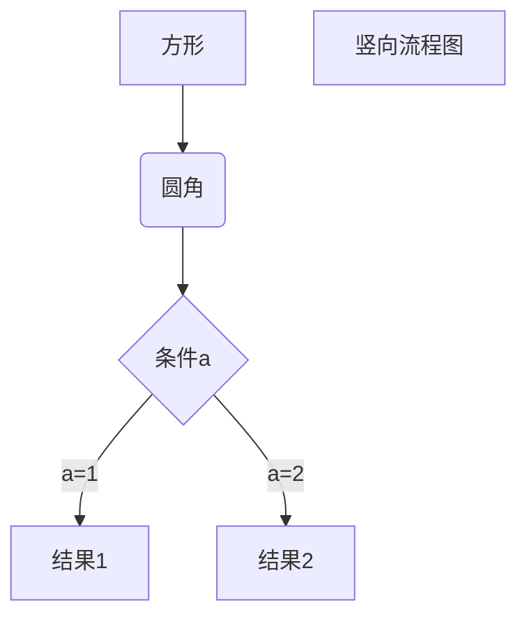
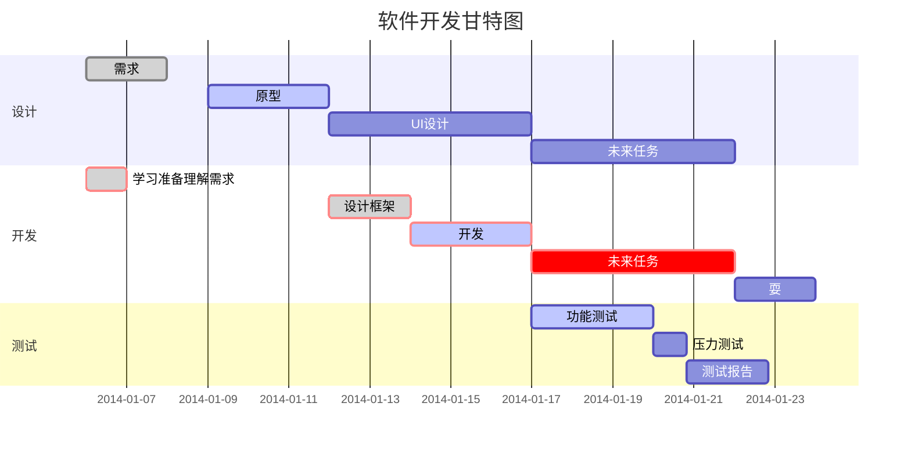
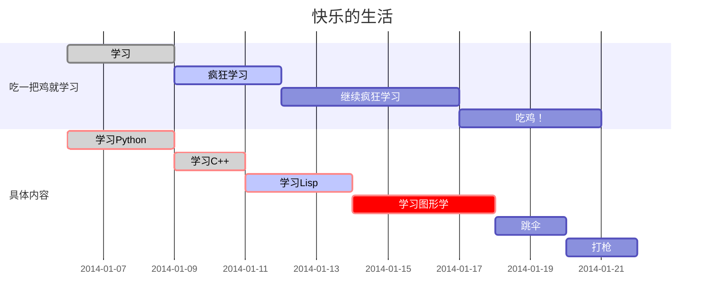

# Demo

## 1. Sequence

```sequence
李雷 -> 韩梅梅: Hello 梅梅, How are you?
Note right of 韩梅梅: 韩梅梅心想
韩梅梅 --> 李雷: I'm fine, thanks, and you?
```

**UML时序图源码样例：**

~~~markdown
```sequence
对象A->对象B: 对象B你好吗?（请求）
Note right of 对象B: 对象B的描述
Note left of 对象A: 对象A的描述(提示)
对象B-->对象A: 我很好(响应)
对象A->对象B: 你真的好吗？
```
~~~

```sequence
对象A->对象B: 对象B你好吗?（请求）
Note right of 对象B: 对象B的描述
Note left of 对象A: 对象A的描述(提示)
对象B-->对象A: 我很好(响应)
对象A->对象B: 你真的好吗？
```

**UML时序图源码复杂样例：**

~~~markdown
```sequence
Title: 标题：复杂使用
对象A->对象B: 对象B你好吗?（请求）
Note right of 对象B: 对象B的描述
Note left of 对象A: 对象A的描述(提示)
对象B-->对象A: 我很好(响应)
对象B->小三: 你好吗
小三-->>对象A: 对象B找我了
对象A->对象B: 你真的好吗？
Note over 小三,对象B: 我们是朋友
participant C
Note right of C: 没人陪我玩
```
~~~

```sequence
Title: 标题：复杂使用
对象A->对象B: 对象B你好吗?（请求）
Note right of 对象B: 对象B的描述
Note left of 对象A: 对象A的描述(提示)
对象B-->对象A: 我很好(响应)
对象B->小三: 你好吗
小三-->>对象A: 对象B找我了
对象A->对象B: 你真的好吗？
Note over 小三,对象B: 我们是朋友
participant C
Note right of C: 没人陪我玩
```

**UML标准时序图样例：**

~~~markdown

~~~


## 2. Flowchart

**横向流程图源码格式：**

~~~markdown

~~~


**竖向流程图源码格式：**

~~~markdown

~~~


**标准流程图源码格式：**

~~~markdown
```flow
st=>start: 开始框
op=>operation: 处理框
cond=>condition: 判断框(是或否?)
sub1=>subroutine: 子流程
io=>inputoutput: 输入输出框
e=>end: 结束框
st->op->cond
cond(yes)->io->e
cond(no)->sub1(right)->op
```
~~~

```flow
st=>start: 开始框
op=>operation: 处理框
cond=>condition: 判断框(是或否?)
sub1=>subroutine: 子流程
io=>inputoutput: 输入输出框
e=>end: 结束框
st->op->cond
cond(yes)->io->e
cond(no)->sub1(right)->op
```

**标准流程图源码格式（横向）：**

~~~markdown
```flow
st=>start: 开始框
op=>operation: 处理框
cond=>condition: 判断框(是或否?)
sub1=>subroutine: 子流程
io=>inputoutput: 输入输出框
e=>end: 结束框
st(right)->op(right)->cond
cond(yes)->io(bottom)->e
cond(no)->sub1(right)->op
```
~~~

```flow
st=>start: 开始框
op=>operation: 处理框
cond=>condition: 判断框(是或否?)
sub1=>subroutine: 子流程
io=>inputoutput: 输入输出框
e=>end: 结束框
st(right)->op(right)->cond
cond(yes)->io(bottom)->e
cond(no)->sub1(right)->op
```


```flow
st=>start: 闹钟响起
op=>operation: 与床板分离
cond=>condition: 分离成功?
e=>end: 快乐的一天

st->op->cond
cond(yes)->e
cond(no)->op
```

## 3. Gantt

```markdown
​```mermaid
%% 语法示例
        gantt
        dateFormat  YYYY-MM-DD
        title 软件开发甘特图
        section 设计
        需求                      :done,    des1, 2014-01-06,2014-01-08
        原型                      :active,  des2, 2014-01-09, 3d
        UI设计                     :         des3, after des2, 5d
    未来任务                     :         des4, after des3, 5d
        section 开发
        学习准备理解需求                      :crit, done, 2014-01-06,24h
        设计框架                             :crit, done, after des2, 2d
        开发                                 :crit, active, 3d
        未来任务                              :crit, 5d
        耍                                   :2d
        section 测试
        功能测试                              :active, a1, after des3, 3d
        压力测试                               :after a1  , 20h
        测试报告                               : 48h
​```
```





## 4. Table

**Cmd + Shitf + T**

|      |      |
| ---- | ---- |
|      |      |

## 5. LaTeX

Typora 原生支持 LaTeX 语法，你有两种方式输入 LaTeX 风格的数学公式：

1. **行内公式（inline）：**用 `$...$` 括起公式，公式会出现在行内。
2. **块间公式（display）：**用 `$$...$$` 括起公式（注意 `$$` 后需要换行），公式会默认显示在行中间。
3. 具体的 LaTeX 语法在此不赘述了，你可以在 [这篇文章](https://blog.csdn.net/happyday_d/article/details/83715440) 中查看。

当你需要在编辑器中插入数学公式时，可以使用两个美元符 $$ 包裹 TeX 或 LaTeX 格式的数学公式来实现。提交后，问答和文章页会根据需要加载 Mathjax 对数学公式进行渲染。如：

```latex
$$
\mathbf{V}_1 \times \mathbf{V}_2 =  \begin{vmatrix} 
\mathbf{i} & \mathbf{j} & \mathbf{k} \\
\frac{\partial X}{\partial u} &  \frac{\partial Y}{\partial u} & 0 \\
\frac{\partial X}{\partial v} &  \frac{\partial Y}{\partial v} & 0 \\
\end{vmatrix}
$$
```


## 6. Coding

1. 行内代码：用 ``...`` 或 ```...``` 括起代码，代码会以主题中设置的样式出现在行内，但不会实现代码高亮。
2. 代码块：输入 ``     ``` 后并输入语言名，换行，开始写代码，Typora 就会自动帮你实现代码高亮。Typora 原生支持许多编程语言代码块的语法高亮，基本日常常用的编程语言它都能很好地支持。 
   除此以外，你也可以直接换行开始写，而后再选择语言。

```python
import pandas as pd
import numpy as np
```

## 7. List

有序列表使用数字并加上 **.** 号来表示，如：

1. 1

2. 2

3. 3

4. 4

   

- [ ] adsf
- [ ] Sad
- [x] dasf
- [x] Asdf

无序列表使用星号(*****)、加号(**+**)或是减号(**-**)作为列表标记

- adsf

- adsf

- adfasdf

- asdf

- ad

- fa

  

### 列表嵌套

列表嵌套只需在子列表中的选项前面添加四个空格即可：

1. 第一项
   - 第一子项
   - 第二子项

2. 第二项
   - 第一子项
   - 


## 8. Others

~~dsafdasf~~

<u>dsafdsaf</u>

<!--dsafasdfasdfadf-->

<kbd>Ctrl</kbd>+<kbd>Alt</kbd>+<kbd>Del</kbd> 重启电脑

```
<kbd>Ctrl</kbd>+<kbd>Alt</kbd>+<kbd>Del</kbd> 重启电脑
```

### 转义

Markdown 使用了很多特殊符号来表示特定的意义，如果需要显示特定的符号则需要使用转义字符，Markdown 使用反斜杠转义特殊字符：

**文本加粗** 
\*\* 正常显示星号 \*\*

```
**文本加粗** 
\*\* 正常显示星号 \*\*
```


